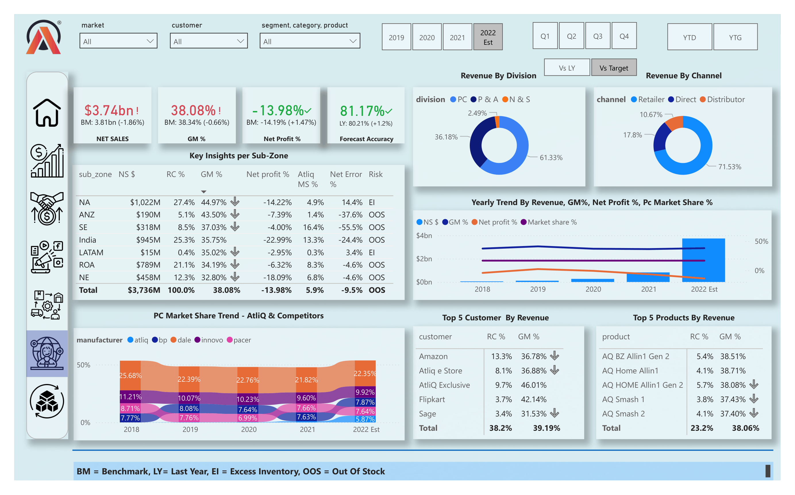
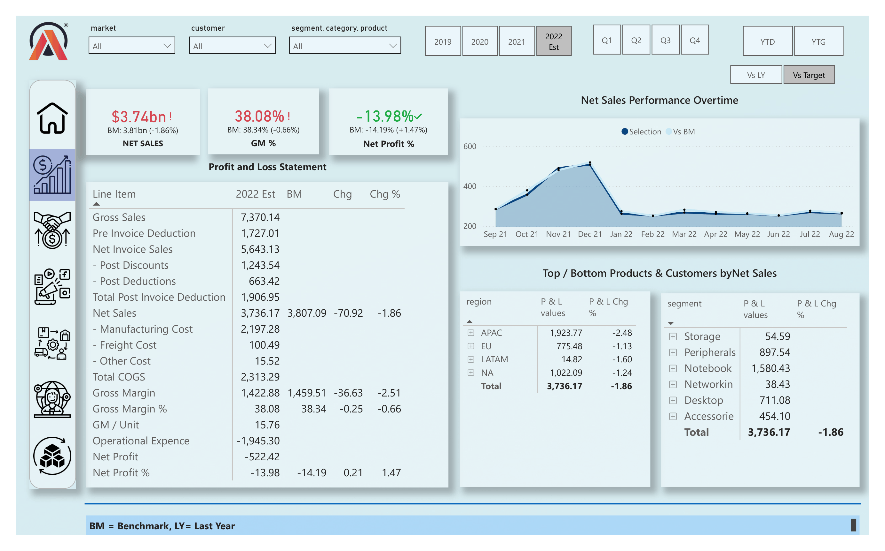
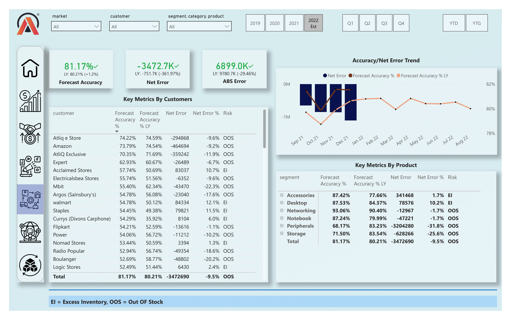
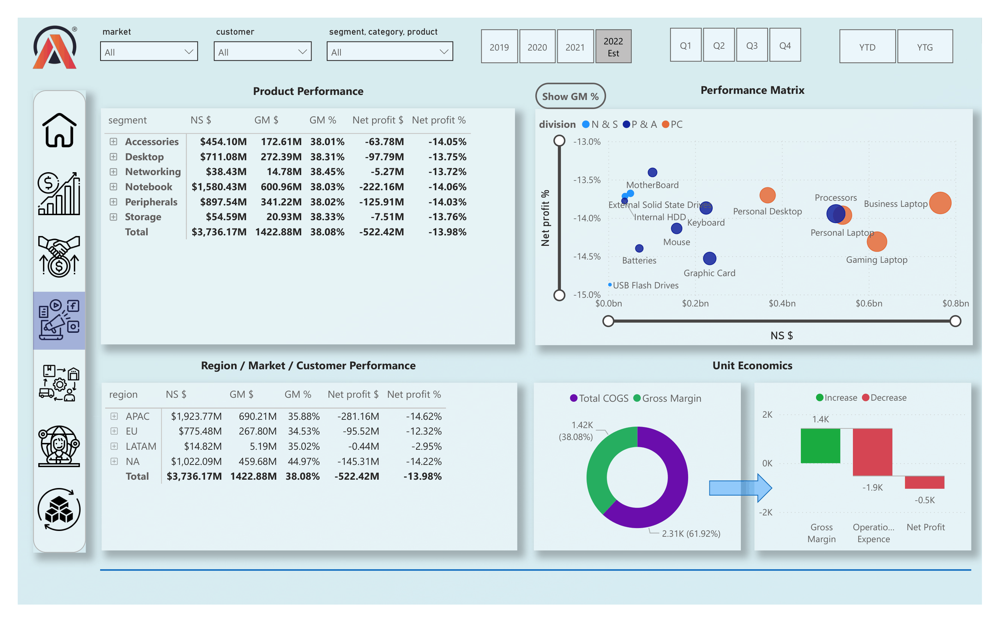
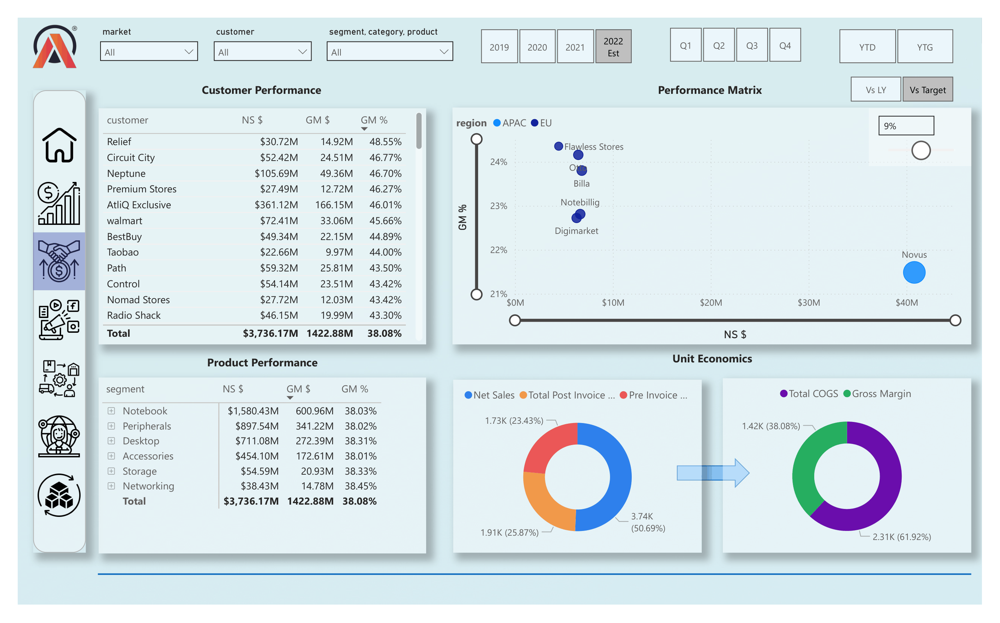
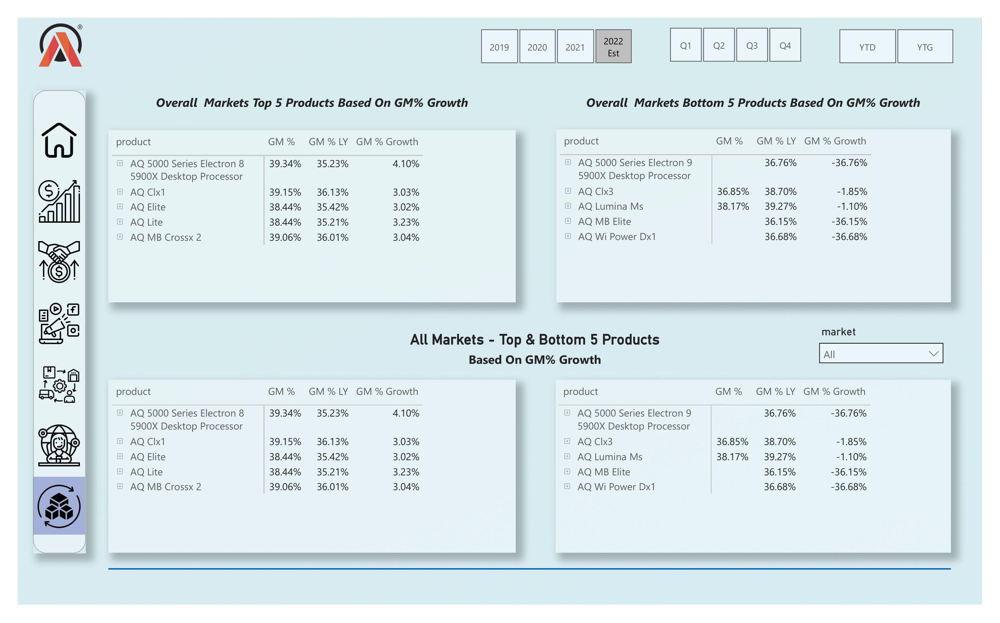
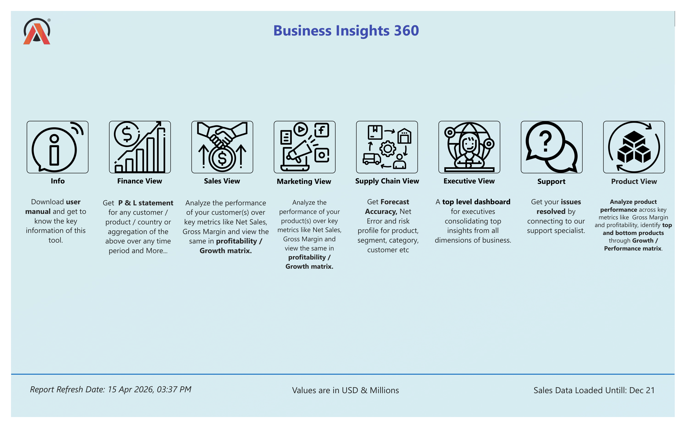
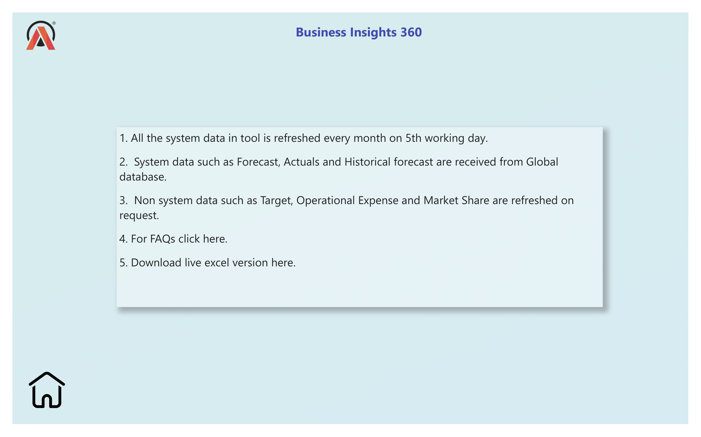
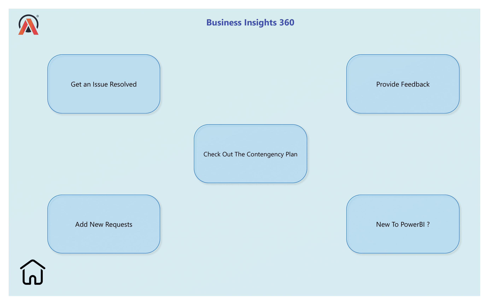
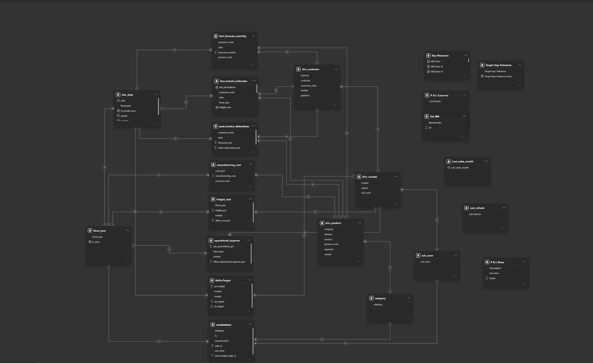

<h1 align="center">📊 Business Insights 360</h1>


<h3 align="center">
Enterprise Business Intelligence Solution | Power BI
</h3>

<p align="center">
Transforming business intuition into data-driven strategic decision-making.
</p>

<p align="center">
  
  
  
  
  
</p>

<p align="center">
  <a href="https://app.powerbi.com/view?r=eyJrIjoiZDI4MjM0ZGMtY2YwNi00NDY4LWE3MjEtZGE0NGFkNTNjZTAxIiwidCI6ImM2ZTU0OWIzLTVmNDUtNDAzMi1hYWU5LWQ0MjQ0ZGM1YjJjNCJ9">
    
  </a>
</p>

---

# 📌 Project Overview

In today’s fast-paced business environment, organizations that rely on intuition alone often struggle to scale efficiently. As Atliq Hardware  expanded its global footprint in the electronics and Goods Market industry, the need for a unified, intelligence-driven decision-making ecosystem became increasingly critical.

**Business Insights 360** was designed as an enterprise-grade business intelligence solution that transforms complex business data into clear, actionable insights for decision-makers across the organization.

Built using Power BI, this platform delivers a comprehensive 360° analytical view spanning Finance, Sales, Marketing, Supply Chain, Product Performance, and Executive Strategy—empowering stakeholders with real-time visibility, performance monitoring, and strategic decision support.

More than just a dashboard, this project represents a complete business intelligence ecosystem focused on enabling smarter, faster, and data-driven growth.

---
# 🔗 Live Interactive Dashboard

Experience the fully interactive Power BI dashboard here:

👉 **[Business Insights 360 Dashboard](https://app.powerbi.com/view?r=eyJrIjoiZDI4MjM0ZGMtY2YwNi00NDY4LWE3MjEtZGE0NGFkNTNjZTAxIiwidCI6ImM2ZTU0OWIzLTVmNDUtNDAzMi1hYWU5LWQ0MjQ0ZGM1YjJjNCJ9)**

Explore interactive insights across:

✅ Executive View  
✅ Finance Analytics  
✅ Sales Performance  
✅ Marketing Performance  
✅ Supply Chain Analysis  
✅ Product Insights  

---

> **Note:** Best viewed on desktop/laptop for full interactive experience.

# 📌 Problem Statement

Atliq Hardware , one of the fastest-growing companies in the electronics goods industry, was expanding rapidly across global markets. However, despite this growth, the company faced significant losses in the Latin American region due to business decisions being driven primarily by surveys, assumptions, and intuition rather than reliable analytical insights.

The leadership team lacked a centralized platform to monitor financial performance, track operational risks, analyze profitability, and compare business performance across markets, customers, and products.

This created several business challenges:

❌ Poor forecasting accuracy leading to supply chain inefficiencies  
❌ Inventory risks such as **Out of Stock (OOS)** and **Excess Inventory (EI)**  
❌ Limited visibility into regional profitability performance  
❌ Difficulty identifying top-performing customers and products  
❌ Weak executive-level decision support  
❌ Lack of cross-functional business transparency  

As part of the company’s transition toward a **data-driven decision-making culture**, the objective was to build a centralized business intelligence solution that could provide end-to-end visibility across critical business functions.

---

# 🚀 Solution Approach

To address these challenges, I developed **Business Insights 360**, an enterprise-grade Power BI analytics platform designed to provide a unified 360° view of business performance across multiple departments.

The dashboard enables stakeholders to:

✅ Monitor financial health through dynamic P&L reporting  
✅ Track forecast accuracy and supply chain risks  
✅ Analyze customer and product profitability  
✅ Measure market share and revenue performance  
✅ Compare actuals against benchmarks and targets  
✅ Support executive strategic decision-making with consolidated insights  

This solution transforms raw business data into actionable intelligence, helping Atliq shift from intuition-based decisions to data-driven strategy.# 🖼 Dashboard Preview

## Executive View


---

## Finance View


---

## Supply Chain View


---

## Marketing View


---

## Sales View


---

## Product View


---

## Home Page


---

## Support page


---

## Info page



## Data Model Architecture


---

# 🛠 Tech Stack

| Technology | Usage |
|----------|-------|
| Power BI | Dashboard Development |
| Power Query | ETL & Data Cleaning |
| DAX | KPI Calculations & Business Logic |
| MySQL | Source Database |
| Excel | Supporting Analytics |

---

# 📊 Dashboard Modules

## 💰 Finance Analytics
Provides financial health visibility with:

- Net Sales
- Gross Margin %
- Net Profit %
- Profit & Loss Statement
- Revenue Trend Analysis
- Segment & Regional Comparison
- Benchmark Performance Tracking

---

## 🚚 Supply Chain Analytics
Operational forecasting and risk management insights:

- Forecast Accuracy %
- Net Error
- ABS Error
- Inventory Risk Classification
- OOS vs EI Analysis
- Customer Risk Performance
- Product Forecast Trends

---

## 📣 Marketing Analytics
Product performance and profitability intelligence:

- Product Profitability Matrix
- Segment Analysis
- Region Performance
- Unit Economics
- Cost Structure Breakdown
- Waterfall Analysis

---

## 🤝 Sales Analytics
Commercial performance monitoring:

- Customer Performance
- Product Performance
- Revenue Contribution Analysis
- Margin Analysis
- Performance Comparison

---

## 👔 Executive Analytics
High-level strategic dashboard:

- Revenue by Division
- Revenue by Channel
- Market Share Trends
- Forecast Accuracy
- Top Products
- Top Customers
- Sub-zone Business Insights
- Yearly Performance Trends

---

## 📦 Product Analytics
Focused product performance evaluation:

- Top 5 Products by GM Growth
- Bottom 5 Products by GM Growth
- Product Comparison Analytics
- Profitability Trend Monitoring

---

# 🧠 Key KPIs

### Financial KPIs
- Net Sales
- Gross Margin
- Net Profit
- Gross Sales
- Total COGS
- Operational Expense
- Freight Cost
- Manufacturing Cost

### Supply Chain KPIs
- Forecast Accuracy
- Net Error
- ABS Error
- Risk %
- Inventory Risk

### Strategic KPIs
- Market Share %
- Atliq Market Share
- Revenue Contribution %
- Benchmark Variance
- Target Variance
- YoY Performance

---

# 🏗 Data Architecture

Implemented using a **hybrid star schema model**.

### Dimension Tables
```text
dim_customer
dim_date
dim_market
dim_product
```

### Fact Tables
```text
fact_actuals_estimates
fact_forecast_monthly
```

### Supporting Tables
```text
freight_cost
manufacturing_cost
operational_expense
marketshare
NsGmTarget
```

### Semantic Layer
```text
Key Measures
```

This architecture enables scalable reporting and efficient business calculations.

---

# ✨ Advanced Features

✅ Interactive page navigation  
✅ Dynamic slicers  
✅ Benchmark comparison logic  
✅ Target variance analysis  
✅ Forecast intelligence  
✅ Risk classification engine  
✅ Performance matrix visualizations  
✅ Waterfall analytics  
✅ Dynamic KPI framework  
✅ Market share trend analysis  
✅ Executive summary storytelling  
✅ Enterprise dashboard UX  

---

Enhanced dashboard performance using **DAX Studio** by analyzing query execution and optimizing DAX calculations, improving report responsiveness by approximately **5%** and delivering a smoother analytical experience.

---

# 📈 Business Insights Generated

Key insights surfaced from analysis:

📌 Latin America identified as an underperforming region  
📌 Forecast inaccuracies exposed supply chain inefficiencies  
📌 High-performing products and customers identified  
📌 Profitability drivers highlighted across business segments  
📌 Market share trends benchmarked against competitors  
📌 Executive performance visibility significantly improved  

---

# 📂 Repository Structure

```bash
business-insights-360-powerbi/
├── Screenshots/
│   ├── executive-view.png
│   ├── finance-view.png
│   ├── supply-chain-view.png
│   ├── marketing-view.png
│   ├── sales-view.png
│   ├── product-view.png
│   └── data-model.png
│
├── README.md
└── LICENSE
```

---

# 📚 Key Learnings

Through this project, I strengthened my skills in:

- Advanced DAX development
- Enterprise Power BI architecture
- KPI engineering
- Data modeling
- Forecast analytics
- Financial reporting
- Business storytelling
- Dashboard UX design
- Cross-functional analytics

---

# 👨‍💻 About Me

## MD Sameer

Aspiring Data Analyst passionate about building data-driven business intelligence solutions.

---

# ⭐ Support

If you found this project valuable:

🌟 Star this repository  
💬 Share feedback  
🤝 Connect for collaboration  

---
